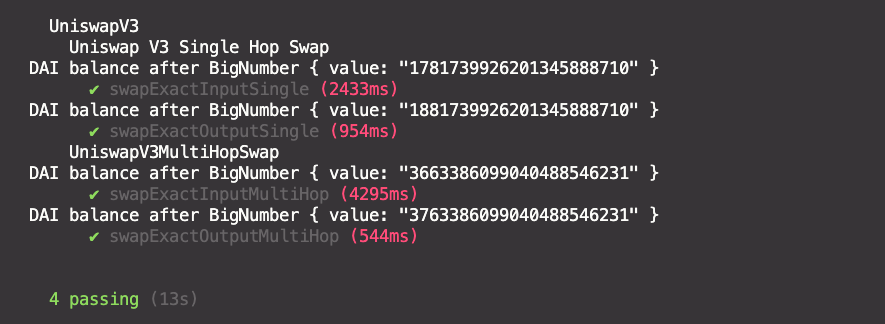
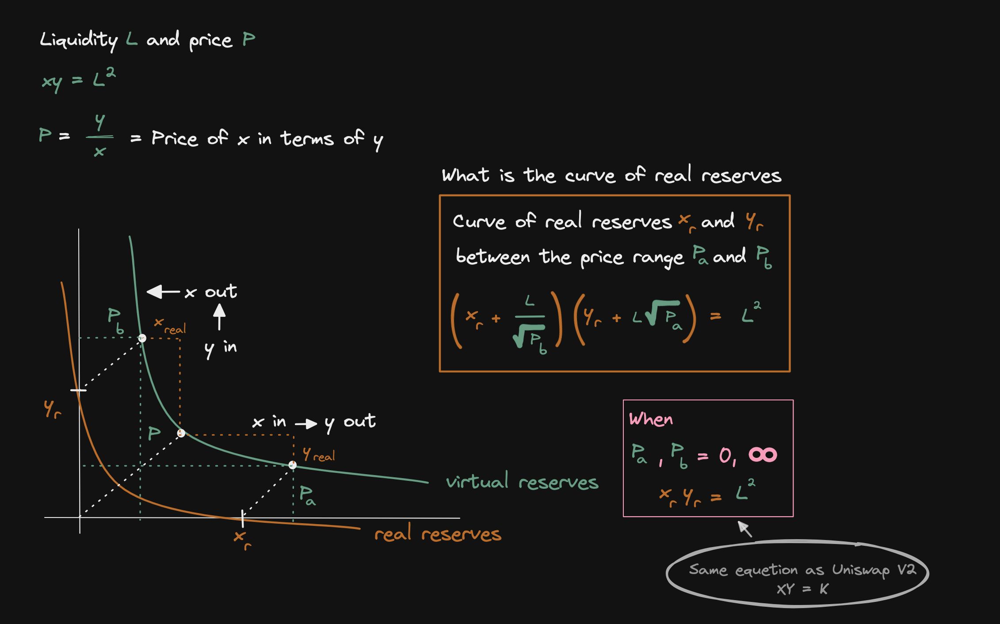
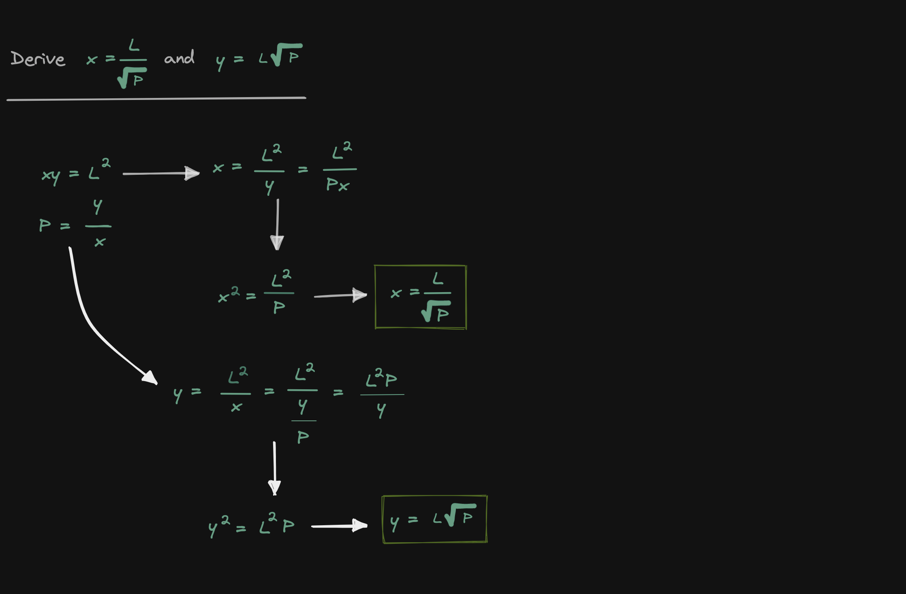
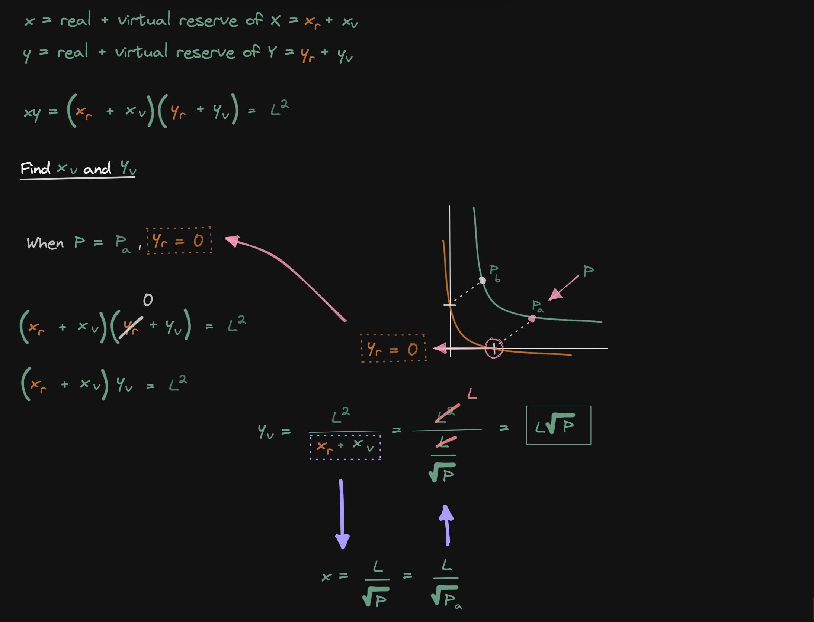
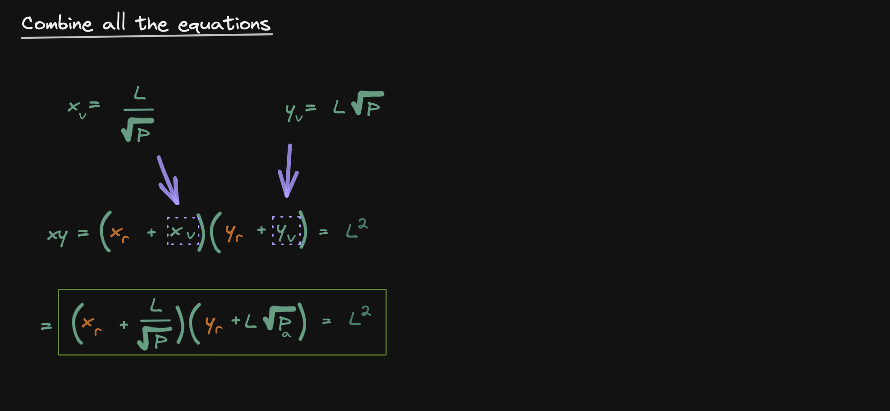
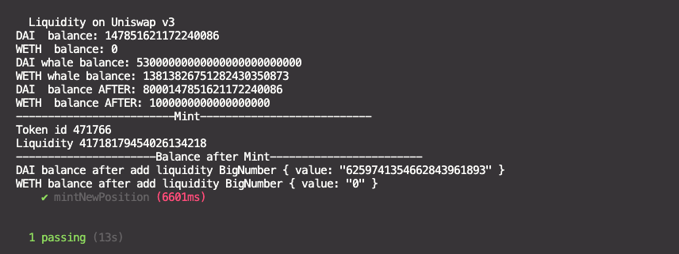

<a name="readme-top"></a>

[![Contributors][contributors-shield]][contributors-url]
[![Forks][forks-shield]][forks-url]
[![Stargazers][stars-shield]][stars-url]
[![Issues][issues-shield]][issues-url]
[![MIT License][license-shield]][license-url]
[![LinkedIn][linkedin-shield]][linkedin-url]

<!-- PROJECT LOGO -->
<br />
<div align="center">
  <a href="https://github.com/Aboudoc/Uniswap-v3.git">
    
  </a>

<h3 align="center">Uniswap V3</h3>

  <p align="center">
    Uniswap V3
    <br />
    <a href="https://github.com/Aboudoc/Uniswap-v3"><strong>Explore the docs »</strong></a>
    <br />
    <br />
    <a href="https://github.com/Aboudoc/Uniswap-v3">View Demo</a>
    ·
    <a href="https://github.com/Aboudoc/Uniswap-v3/issues">Report Bug</a>
    ·
    <a href="https://github.com/Aboudoc/Uniswap-v3/issues">Request Feature</a>
  </p>
</div>

<!-- TABLE OF CONTENTS -->
<details>
  <summary>Table of Contents</summary>
  <ol>
    <li>
      <a href="#about-the-project">About The Project</a>
      <ul>
        <li><a href="#built-with">Built With</a></li>
      </ul>
    </li>
    <li>
      <a href="#getting-started">Getting Started</a>
      <ul>
        <li><a href="#prerequisites">Prerequisites</a></li>
        <li><a href="#installation">Installation</a></li>
      </ul>
    </li>
    <li><a href="#usage">Usage</a></li>
    <li><a href="#Constant-Product-AMM">Constant Product AMM</a></li>
    <li><a href="#Test">Test</a></li>
    <li><a href="#Uniswap-V3-Single-Hop-Swap">Uniswap V2 Single Hop Swap</a></li>
    <ul>
        <li><a href="#State-variables">State variables</a></li>
        <li><a href="#Function-swapExactInputSingleHop">Function swapExactInputSingleHop</a></li>
        <li><a href="#Function-swapExactOutputSingleHop">Function swapExactOutputSingleHop</a></li>
      </ul>
      <li><a href="#Uniswap-V3-Multi-Hop-Swap">Uniswap V3 Multi Hop Swap</a></li>
    <ul>
        <li><a href="#State-variables">State variables</a></li>
        <li><a href="#Function-swapExactInputMultiHop">Function swapExactInputMultiHop</a></li>
        <li><a href="#Function-swapExactOutputMultiHop">Function swapExactOutputMultiHop</a></li>
      </ul>
    <li><a href="#Uniswap-V3-Curve-of-real-reserves">Uniswap V3 Curve of real reserves</a></li> 
    <li><a href="#Test-Mint-new-position">Test Mint new position</a></li>
    <li><a href="#Uniswap-V3-Add-and-Remove-Liquidity">Uniswap V2 Add and Remove Liquidity</a></li>
    <ul>
        <li><a href="#State-variables">State variables</a></li>
        <li><a href="#Constructor">Constructor</a></li>
        <li><a href="#Function-addLiquidity">Function addLiquidity</a></li>
        <li><a href="#Function-removeLiquidiquiity">Function removeLiquidiquiity</a></li>
      </ul>
    <li><a href="#Uniswap-V3-Flash-Swap">Uniswap V2 Flash Swap</a></li>
    <ul>
        <li><a href="#State-variables">State variables</a></li>
        <li><a href="#Constructor">Constructor</a></li>
        <li><a href="#Function-flashSwap">Function flashSwap</a></li>
      </ul>
    <li><a href="#Forking-mainnet">Forking mainnet</a></li>
    <li><a href="#Note">Note</a></li>
    <li><a href="#roadmap">Roadmap</a></li>
    <li><a href="#contributing">Contributing</a></li>
    <li><a href="#license">License</a></li>
    <li><a href="#contact">Contact</a></li>
    <li><a href="#acknowledgments">Acknowledgments</a></li>
  </ol>
</details>

<!-- ABOUT THE PROJECT -->

## About The Project

This project shows how to interact with the main functions of Uniswap V2

<p align="right">(<a href="#readme-top">back to top</a>)</p>

### Built With

- [![Hardhat][Hardhat]][Hardhat-url]
- [![Ethers][Ethers.js]][Ethers-url]

<p align="right">(<a href="#readme-top">back to top</a>)</p>

<!-- GETTING STARTED -->

## Getting Started

To get a local copy up and running follow these simple example steps.

### Prerequisites

- npm

  ```sh
  npm init
  ```

- hardhat

  ```sh
  npm install --save-dev hardhat
  ```

  run:

  ```sh
  npx hardhat
  ```

  verify:

  ```sh
  npx hardhat verify --network goerli "contract address" "pair address"
  ```

### Installation

1. Clone the repo
   ```sh
   git clone https://github.com/Aboudoc/Uniswap-v3.git
   ```
2. Install NPM packages
   ```sh
   npm install
   ```
3. Dependencies

   ```sh
    npm add @uniswap/v3-periphery @uniswap/v3-core
   ```

   For openzeppelin contract, we'll need to install first `solidity 0.7`

   ```sh
   npm i @openzeppelin/contracts@3.4.2
   ```

   To fix compiler errors, **_we'll need to change the compilation settings_**

<p align="right">(<a href="#readme-top">back to top</a>)</p>

<!-- USAGE EXAMPLES -->

## Usage

If you need testnet funds, use the [Alchemy testnet faucet](https://goerlifaucet.com/).

**This project shows how to swap, add and remove liquidity**

## Constant Product AMM

Uniswap V3 is a Constant product AMM (automated market maker) <=> a decentralized exchange where 2 tokens are traded.
You can find a deep overview of CPAMM in [this repo](https://github.com/Aboudoc/Constant-Product-AMM)

## Test Swap

```sh
npx hardhat test test/unlock-account.test.js
```

```sh
npx hardhat test test/swapV3.test.js
```

<div>

</div>

## Uniswap V3 Single Hop Swap

This contract introduces 2 functions to perform single hop swaps on Uniswap V3

`exactInputSingle` - Sell all of input token.
`exactOutputSingle` - Buy specific amount of output token.

### State variables

1. Address of tokens (2 or 3) and the address of the router
2. Set interfaces for tokens and router

### Function swapExactInputSingleHop

1. Transfer `amountIn` from `msg.sender`
2. Approve `amountIn` to `router`
3. Set the `params` by preparing struct ISwapRouter.ExactInputSingleParams
4. Call `exactInputSingle` on ISwapRouter (router interface)

### Function swapExactOutputSingleHop

1. Transfer `amountInMax`from `msg.sender`
2. Approve `amountInMax` to `router`
3. Set the `params` by preparing struct ISwapRouter.ExactOutputSingleParams
4. Call `exactOutputSingle` on ISwapRouter and store amount of WETH spent by Uniswap in amountIn (uint)
5. Refund WETH not spent back to msg.sender
6. Reset approvals of WETH for router to 0

## Uniswap V3 Multi Hop Swap

Swap WETH for USDC and then USDC for DAI.

### State variables

1. Address of tokens and the address of the router
2. Set interfaces for tokens and router

### Function swapExactInputMultiHop

This function will swap WETH for maximum amount of DAI.

1. Transfer `amountIn` from `msg.sender`
2. Approve `amountIn` to `router`
3. Setup the swapping `path`
4. Prepare struct ISwapRouter.ExactInputParams
5. Execute the trade by calling `router.exactInput` with the parameters prepared above

### Function swapExactOutputMultiHop

This function will swap minimum amount of WETH for a specific amount of DAI.

1. Transfer `amountInMax`from `msg.sender`
2. Approve `amountInMax` to `router`
3. Setup the swapping `path`
4. Call `swapTokensForExactTokens` on IUniswapV2Router and store the actual amount of token in swapped for token out in amountSwap (uint)
5. Refund efund WETH not spent back to msg.sender
6. Reset approvals of WETH for router to 0

<p align="right">(<a href="#readme-top">back to top</a>)</p>

## Uniswap V3 Curve of real reserves

In Uniswap V3 the curve of the real reserve is giving by the formula below (orange square)

Let's derive this equation starting from the constant product equation `XY = K`

<div>

</div>

Let's now derive the equation, the curve for the real reserve

<div>

</div>

Now that we can rewrite x and y in terms of the liquidity L and the current price P, let's now derive the equation for the real reserves

<div>

</div>

The final step to derive the curve for the real reserve is to combine all of the equations that we have derived so far

<div>

</div>

Later on, we will use this equation to derive the `liquidity delta`: changing liquidity when we add some amount of token x and token y

<p align="right">(<a href="#readme-top">back to top</a>)</p>

## Test Mint new position

```sh
npx hardhat test test/unlock-account.test.js
```

```sh
npx hardhat test test/liquidityV3.test.js
```

<div>

</div>

<p align="right">(<a href="#readme-top">back to top</a>)</p>

## Uniswap V3 Add and Remove Liquidity

Manage liquidity in Uniswap V3

Mint new position
Increase liquidity
Decrease liquidity
Collect fees and withdraw tokens

### State variables

Contract inherits from `IERC721Receiver`

1. Address of tokens. Set MIN_TICK, MAX_TICK, TICK_SPACING
2. Set interfaces for tokens and manager with the `INonfungiblePositionManager` interface

### Function onERC721Received

This function is called when safeTransferFrom is called on INonFungiblePositionManager.

### Function onERC721Received

1. Transfer `wethAmountDesired` and `daiAmountDesired` from `msg.sender`
2. Approve `amountwethAmountDesired` and `daiAmountDesired` to `router`
3. Call `addLiqiuidity()` on `router` and store `wethAmount`, `daiAmount` and `liquidity` returned from the function call
4. Refund to msg.sender, excess WETH and DAI that were not added to liquidity

### Function mint

This function removes liquidity from the Uniswap WETH - DAI pool.

1. Transfer DAI and WETH from `msg.sender` into this contract. `amount0ToAdd` is DAI amount,`amount1ToAdd` is WETH
2. Approve `manager` to spend DAI and WETH from this contract
3. Set `tickLower` and `tickUpper`, price range to add liquidity. Both ticks must be a multiple of `TICK_SPACING`.
4. Prepare parameter to add new liquidity and mint new position
5. Add liquidity by calling `manager.mint` with the parameters prepared above
6. manager.mint returns 4 outputs. Refund tokens not added to liquidity back to msg.sender. We pulled in amount0ToAdd and amount1ToAdd. Actual amount added to Uniswap V3 are amount0 and amount1.
7. Reset approvals of DAI and WETH for manager to 0
8. Emit Mint with tokenId.

<p align="right">(<a href="#readme-top">back to top</a>)</p>

## Test Flash Swap

```sh
npx hardhat test test/unlock-account.test.js
```

```sh
npx hardhat test test/flashSwapV3.test.js
```

<!-- <div>

</div> -->

```sh
npx hardhat test test/flashSwapArbV3.test.js
```

<!-- <div>

</div> -->

## Uniswap V3 Flash Swap

Tokens in the pool can be borrowed as long as they are repaid in the same transaction plus fee on borrow.

This is called **flash swap**.

The contract inherit from `IUniswapV2Callee`

### State Variables

1. Address of tokens and the address of the factory
2. Set WETH and factory interface then declare pair (IUniswapV2Pair)

### Constructor

1. Call getPair() on factory and store the result inside pair variable (which is a IUniswapV2Pair interface)

### Funuction flashSwap

1. Prepare data of bytes to send. This can be any data, as long as it is not empty Uniswap will trigger a flash swap. For this example, we encode WETH and msg.sender.
2. Call `swap()`on pair. Find below `swap()` from `IUniswapV2Pair`

```js
function swap(
   uint amount0Out,
   uint amount1Out,
   address to,
   bytes calldata data
) external;

```

`amount0Out`: Amount of token0 to withdraw from the pool => 0

`amount1Out`:Amount of token1 to withdraw from the pool => wethAmount

`to`: Recipient of tokens in the pool => address(this)

`data`: Data to send to uniswapV2Call => data

### Function uniswapV2Call

This function is called by the DAI/WETH pair contract after we called pair.swap.

Immediately before the pool calls this function, the amount of tokens that we requested to borrow is sent. Inside this function, we write our custom code and then repay the borrowed amount plus some fees.

1. Require that `msg.sender` is pair. Only pair contract should be able to call this function.
2. Require `sender` is this contract. Initiator of the flash swap should be this contract.
3. Decode `data`. Inside flashSwap we've encoded WETH and msg.sender.
4. Once the data is decoded, we would write our custom code here (arbitrage). We only emitted events for this example
5. Calculate total amount to repay
6. Transfer fee amount of WETH from caller (about 0.3% fee, +1 to round up)
7. Repay WETH to pair, amount borrowed plus fee

<p align="right">(<a href="#readme-top">back to top</a>)</p>

## Forking mainnet

`hardhat.config.js`

```sh
  networks: {
        hardhat: {
          forking: {
            url: `https://eth-mainnet.alchemyapi.io/v2/${process.env.ALCHEMY_API_KEY}`,
       },
     },
  }
```

Note: Replace the `${}` component of the URL with your personal [Alchemy](https://www.alchemy.com/) API key.

```sh
npx hardhat test test/swapV3.test.js
```

<p align="right">(<a href="#readme-top">back to top</a>)</p>

## Note

This contract assumes that token0 and token1 both have same decimals

Consider Uniswap trading fee = 0.3%

You can find Uniswap pools referenced below. Select a pool with the highest TVL

[Uniswap V3 Pool Infos](https://info.uniswap.org/#/pools)

You can find official Uniswap documentation below:

[Single Hop Swap](https://docs.uniswap.org/contracts/v3/guides/swaps/single-swaps)

[Multi Hop Swap](https://docs.uniswap.org/contracts/v3/guides/swaps/multihop-swaps)

### Further reading

(...soon)

### Sources

<p align="right">(<a href="#readme-top">back to top</a>)</p>

<!-- ROADMAP -->

## Roadmap

- [ ] Uniswap V3 TWAP
- [ ] Further reading
- [ ] Deploy script
- [ ] Unit test

See the [open issues](https://github.com/Aboudoc/Uniswap-v3.git/issues) for a full list of proposed features (and known issues).

<p align="right">(<a href="#readme-top">back to top</a>)</p>

<!-- CONTRIBUTING -->

## Contributing

Contributions are what make the open source community such an amazing place to learn, inspire, and create. Any contributions you make are **greatly appreciated**.

If you have a suggestion that would make this better, please fork the repo and create a pull request. You can also simply open an issue with the tag "enhancement".
Don't forget to give the project a star! Thanks again!

1. Fork the Project
2. Create your Feature Branch (`git checkout -b feature/AmazingFeature`)
3. Commit your Changes (`git commit -m 'Add some AmazingFeature'`)
4. Push to the Branch (`git push origin feature/AmazingFeature`)
5. Open a Pull Request

<p align="right">(<a href="#readme-top">back to top</a>)</p>

<!-- LICENSE -->

## License

Distributed under the MIT License. See `LICENSE.txt` for more information.

<p align="right">(<a href="#readme-top">back to top</a>)</p>

<!-- CONTACT -->

## Contact

Reda Aboutika - [@twitter](https://twitter.com/AboutikaR) - reda.aboutika@gmail.com

Project Link: [https://github.com/Aboudoc/Uniswap-v3.git](https://github.com/Aboudoc/Uniswap-v3.git)

<p align="right">(<a href="#readme-top">back to top</a>)</p>

<!-- ACKNOWLEDGMENTS -->

## Acknowledgments

- [Smart Contract Engineer](https://www.smartcontract.engineer/)

<p align="right">(<a href="#readme-top">back to top</a>)</p>

<!-- MARKDOWN LINKS & IMAGES -->
<!-- https://www.markdownguide.org/basic-syntax/#reference-style-links -->

[contributors-shield]: https://img.shields.io/github/contributors/Aboudoc/Uniswap-v3.svg?style=for-the-badge
[contributors-url]: https://github.com/Aboudoc/Uniswap-v3/graphs/contributors
[forks-shield]: https://img.shields.io/github/forks/Aboudoc/Uniswap-v3.svg?style=for-the-badge
[forks-url]: https://github.com/Aboudoc/Uniswap-v3/network/members
[stars-shield]: https://img.shields.io/github/stars/Aboudoc/Uniswap-v3.svg?style=for-the-badge
[stars-url]: https://github.com/Aboudoc/Uniswap-v3/stargazers
[issues-shield]: https://img.shields.io/github/issues/Aboudoc/Uniswap-v3.svg?style=for-the-badge
[issues-url]: https://github.com/Aboudoc/Uniswap-v3/issues
[license-shield]: https://img.shields.io/github/license/Aboudoc/Uniswap-v3.svg?style=for-the-badge
[license-url]: https://github.com/Aboudoc/Uniswap-v3/blob/master/LICENSE.txt
[linkedin-shield]: https://img.shields.io/badge/-LinkedIn-black.svg?style=for-the-badge&logo=linkedin&colorB=555
[linkedin-url]: https://www.linkedin.com/in/r%C3%A9da-aboutika-34305453/?originalSubdomain=fr
[product-screenshot]: https://ethereum.org/static/28214bb68eb5445dcb063a72535bc90c/9019e/hero.webp
[Hardhat]: https://img.shields.io/badge/Hardhat-20232A?style=for-the-badge&logo=hardhat&logoColor=61DAFB
[Hardhat-url]: https://hardhat.org/
[Ethers.js]: https://img.shields.io/badge/ethers.js-000000?style=for-the-badge&logo=ethersdotjs&logoColor=white
[Ethers-url]: https://docs.ethers.org/v5/
[Vue.js]: https://img.shields.io/badge/Vue.js-35495E?style=for-the-badge&logo=vuedotjs&logoColor=4FC08D
[Vue-url]: https://vuejs.org/
[Angular.io]: https://img.shields.io/badge/Angular-DD0031?style=for-the-badge&logo=angular&logoColor=white
[Angular-url]: https://angular.io/
[Svelte.dev]: https://img.shields.io/badge/Svelte-4A4A55?style=for-the-badge&logo=svelte&logoColor=FF3E00
[Svelte-url]: https://svelte.dev/
[Laravel.com]: https://img.shields.io/badge/Laravel-FF2D20?style=for-the-badge&logo=laravel&logoColor=white
[Laravel-url]: https://laravel.com
[Bootstrap.com]: https://img.shields.io/badge/Bootstrap-563D7C?style=for-the-badge&logo=bootstrap&logoColor=white
[Bootstrap-url]: https://getbootstrap.com
[JQuery.com]: https://img.shields.io/badge/jQuery-0769AD?style=for-the-badge&logo=jquery&logoColor=white
[JQuery-url]: https://jquery.com
