<a name="readme-top"></a>

[![Contributors][contributors-shield]][contributors-url]
[![Forks][forks-shield]][forks-url]
[![Stargazers][stars-shield]][stars-url]
[![Issues][issues-shield]][issues-url]
[![MIT License][license-shield]][license-url]
[![LinkedIn][linkedin-shield]][linkedin-url]

<!-- PROJECT LOGO -->
<br />
<div align="center">
  <a href="https://github.com/Aboudoc/Uniswap-v3.git">
    
  </a>

<h3 align="center">Uniswap V3</h3>

  <p align="center">
    Uniswap V3
    <br />
    <a href="https://github.com/Aboudoc/Uniswap-v3"><strong>Explore the docs »</strong></a>
    <br />
    <br />
    <a href="https://github.com/Aboudoc/Uniswap-v3">View Demo</a>
    ·
    <a href="https://github.com/Aboudoc/Uniswap-v3/issues">Report Bug</a>
    ·
    <a href="https://github.com/Aboudoc/Uniswap-v3/issues">Request Feature</a>
  </p>
</div>

<!-- TABLE OF CONTENTS -->
<details>
  <summary>Table of Contents</summary>
  <ol>
    <li>
      <a href="#about-the-project">About The Project</a>
      <ul>
        <li><a href="#built-with">Built With</a></li>
      </ul>
    </li>
    <li>
      <a href="#getting-started">Getting Started</a>
      <ul>
        <li><a href="#prerequisites">Prerequisites</a></li>
        <li><a href="#installation">Installation</a></li>
      </ul>
    </li>
    <li><a href="#usage">Usage</a></li>
    <li><a href="#Constant-Product-AMM">Constant Product AMM</a></li>
    <li><a href="#Test-Single-and-Multi-hop-swap">Test Single and Multi hop swap</a></li>
    <li><a href="#Uniswap-V3-Single-Hop-Swap">Uniswap V2 Single Hop Swap</a></li>
    <ul>
        <li><a href="#State-variables">State variables</a></li>
        <li><a href="#Function-swapExactInputSingleHop">Function swapExactInputSingleHop</a></li>
        <li><a href="#Function-swapExactOutputSingleHop">Function swapExactOutputSingleHop</a></li>
      </ul>
      <li><a href="#Uniswap-V3-Multi-Hop-Swap">Uniswap V3 Multi Hop Swap</a></li>
    <ul>
        <li><a href="#State-variables">State variables</a></li>
        <li><a href="#Function-swapExactInputMultiHop">Function swapExactInputMultiHop</a></li>
        <li><a href="#Function-swapExactOutputMultiHop">Function swapExactOutputMultiHop</a></li>
      </ul>
    <li><a href="#Uniswap-V3-Curve-of-real-reserves">Uniswap V3 Curve of real reserves</a></li> 
    <li><a href="#Test-Mint-new-position">Test Mint new position</a></li>
    <li><a href="#Uniswap-V3-Liquidity-of-a-single-position">Uniswap V3 Liquidity of a single position</a></li> 
    <li><a href="#Test-Collect-fees">Test Collect fees</a></li>
    <li><a href="#Test-Increase-liquidity">Test Increase liquidity</a></li>
    <li><a href="#Test-Decrease-liquidity">Test Decrease liquidity</a></li>
    <li><a href="#Uniswap-V3-Liquidity-Delta">Uniswap V3 Liquidity Delta</a></li>
    <li><a href="#Uniswap-V3-How-many-tokens-to-add">Uniswap V3 How many tokens to add</a></li>
    <li><a href="#Uniswap-V3-Add-and-Remove-Liquidity">Uniswap V2 Add and Remove Liquidity</a></li>
    <ul>
        <li><a href="#State-variables">State variables</a></li>
        <li><a href="#Constructor">Constructor</a></li>
        <li><a href="#Function-addLiquidity">Function addLiquidity</a></li>
        <li><a href="#Function-removeLiquidiquiity">Function removeLiquidiquiity</a></li>
      </ul>
    <li><a href="#Uniswap-V3-Price-of-ETH-from-sqrtPriceX96">Uniswap V3 Price of ETH from sqrtPriceX96</a></li>
    <li><a href="#Uniswap-V3-Tick-and-sqrtPriceX96">Uniswap V3 Tick and sqrtPriceX96</a></li>
    <li><a href="#Uniswap-V3-Price-Change-from-a-Swap">Uniswap V3 Price Change from a Swap</a></li>
    <li><a href="#Uniswap-V3-Liquidity-Price-Graph">Uniswap V3 Liquidity Price Graph</a></li>
    <li><a href="#Uniswap-V3-Liquidity-Price-Graph-Example">Uniswap V3 Liquidity Price Graph Example</a></li>
    <li><a href="#Uniswap-V3-Flash-Swap">Uniswap V2 Flash Swap</a></li>
    <ul>
        <li><a href="#State-variables">State variables</a></li>
        <li><a href="#Constructor">Constructor</a></li>
        <li><a href="#Function-flashSwap">Function flashSwap</a></li>
      </ul>
    <li><a href="#Forking-mainnet">Forking mainnet</a></li>
    <li><a href="#Note">Note</a></li>
    <li><a href="#roadmap">Roadmap</a></li>
    <li><a href="#contributing">Contributing</a></li>
    <li><a href="#license">License</a></li>
    <li><a href="#contact">Contact</a></li>
    <li><a href="#acknowledgments">Acknowledgments</a></li>
  </ol>
</details>

<!-- ABOUT THE PROJECT Uniswap V3 - Liquidity of a single position -->

## About The Project

This project shows how to interact with the main functions of Uniswap V3 and derive the equations used in the protocol

<p align="right">(<a href="#readme-top">back to top</a>)</p>

### Built With

- [![Hardhat][Hardhat]][Hardhat-url]
- [![Ethers][Ethers.js]][Ethers-url]

<p align="right">(<a href="#readme-top">back to top</a>)</p>

<!-- GETTING STARTED -->

## Getting Started

To get a local copy up and running follow these simple example steps.

### Prerequisites

- npm

  ```sh
  npm init
  ```

- hardhat

  ```sh
  npm install --save-dev hardhat
  ```

  run:

  ```sh
  npx hardhat
  ```

  verify:

  ```sh
  npx hardhat verify --network goerli "contract address" "pair address"
  ```

### Installation

1. Clone the repo
   ```sh
   git clone https://github.com/Aboudoc/Uniswap-v3.git
   ```
2. Install NPM packages
   ```sh
   npm install
   ```
3. Dependencies

   ```sh
    npm add @uniswap/v3-periphery @uniswap/v3-core
   ```

   For openzeppelin contract, we'll need to install first `solidity 0.7`

   ```sh
   npm i @openzeppelin/contracts@3.4.2
   ```

   To fix compiler errors, **_we'll need to change the compilation settings_**

<p align="right">(<a href="#readme-top">back to top</a>)</p>

<!-- USAGE EXAMPLES -->

## Usage

If you need testnet funds, use the [Alchemy testnet faucet](https://goerlifaucet.com/).

**This project shows how to swap, add and remove liquidity**

## Constant Product AMM

Uniswap V3 is a Constant product AMM (automated market maker) <=> a decentralized exchange where 2 tokens are traded.
You can find a deep overview of CPAMM in [this repo](https://github.com/Aboudoc/Constant-Product-AMM)

## Test Single and Multi hop swap

```sh
npx hardhat test test/unlock-account.test.js
```

```sh
npx hardhat test test/swapV3.test.js
```

<div>

</div>

<p align="right">(<a href="#readme-top">back to top</a>)</p>

## Uniswap V3 Single Hop Swap

This contract introduces 2 functions to perform single hop swaps on Uniswap V3

`exactInputSingle` - Sell all of input token.
`exactOutputSingle` - Buy specific amount of output token.

### State variables

1. Address of tokens (2 or 3) and the address of the router
2. Set interfaces for tokens and router

### Function swapExactInputSingleHop

1. Transfer `amountIn` from `msg.sender`
2. Approve `amountIn` to `router`
3. Set the `params` by preparing struct ISwapRouter.ExactInputSingleParams
4. Call `exactInputSingle` on ISwapRouter (router interface)

### Function swapExactOutputSingleHop

1. Transfer `amountInMax`from `msg.sender`
2. Approve `amountInMax` to `router`
3. Set the `params` by preparing struct ISwapRouter.ExactOutputSingleParams
4. Call `exactOutputSingle` on ISwapRouter and store amount of WETH spent by Uniswap in amountIn (uint)
5. Refund WETH not spent back to msg.sender
6. Reset approvals of WETH for router to 0

## Uniswap V3 Multi Hop Swap

Swap WETH for USDC and then USDC for DAI.

### State variables

1. Address of tokens and the address of the router
2. Set interfaces for tokens and router

### Function swapExactInputMultiHop

This function will swap WETH for maximum amount of DAI.

1. Transfer `amountIn` from `msg.sender`
2. Approve `amountIn` to `router`
3. Setup the swapping `path`
4. Prepare struct ISwapRouter.ExactInputParams
5. Execute the trade by calling `router.exactInput` with the parameters prepared above

### Function swapExactOutputMultiHop

This function will swap minimum amount of WETH for a specific amount of DAI.

1. Transfer `amountInMax`from `msg.sender`
2. Approve `amountInMax` to `router`
3. Setup the swapping `path`
4. Call `swapTokensForExactTokens` on IUniswapV2Router and store the actual amount of token in swapped for token out in amountSwap (uint)
5. Refund efund WETH not spent back to msg.sender
6. Reset approvals of WETH for router to 0

<p align="right">(<a href="#readme-top">back to top</a>)</p>

## Uniswap V3 Curve of real reserves

In Uniswap V3 the curve of the real reserve is giving by the formula below (orange square)

Let's derive this equation starting from the constant product equation `XY = K`

<div>
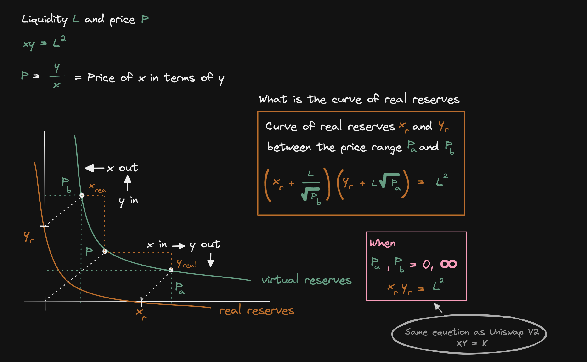
</div>

Let's now derive the equation, the curve for the real reserve

<div>

</div>

Now that we can rewrite `x` and `y` in terms of the liquidity `L` and the current price `P`, let's now derive the equation for the real reserves (solve for Xv and Yv)

<div>
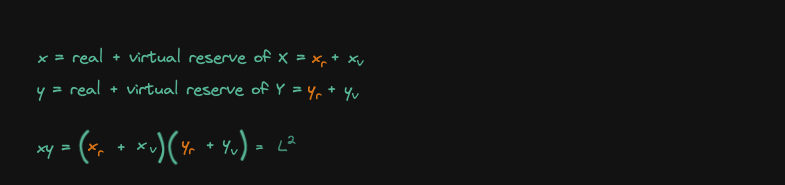
</div>

Let's solve for `Xv`

<div>
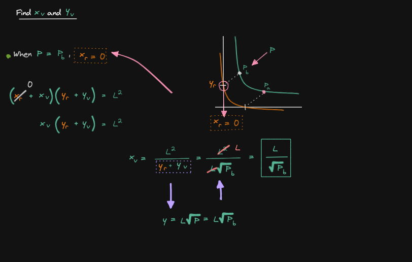
</div>

Let's solve for `Yv`

<div>
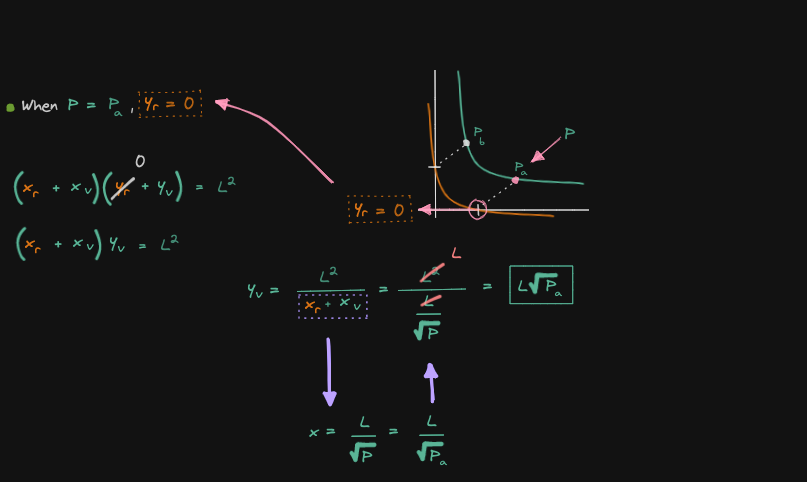
</div>

The final step to derive the curve for the real reserve is to combine all of the equations that we have derived so far

<div>
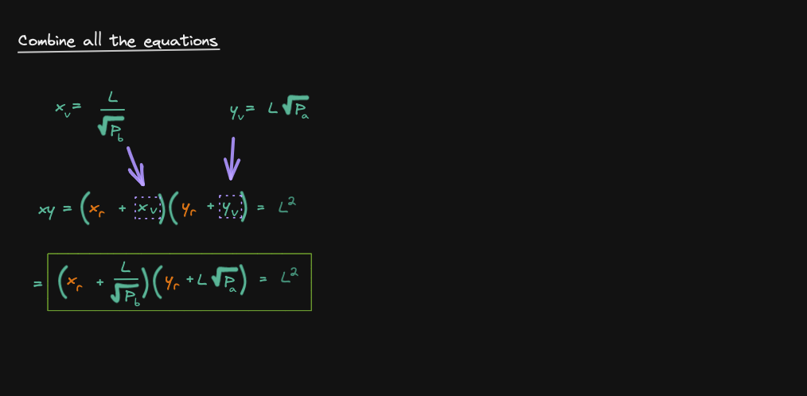
</div>

Later on, we will use this equation to derive the `liquidity delta`: changing liquidity when we add some amount of token x and token y

<p align="right">(<a href="#readme-top">back to top</a>)</p>

## Test Mint new position

```sh
npx hardhat test test/unlock-account.test.js
```

```sh
npx hardhat test test/liquidityV3.test.js
```

<div>

</div>

<p align="right">(<a href="#readme-top">back to top</a>)</p>

## Test Collect fees

```sh
npx hardhat test test/liquidityV3.test.js
```

<div>
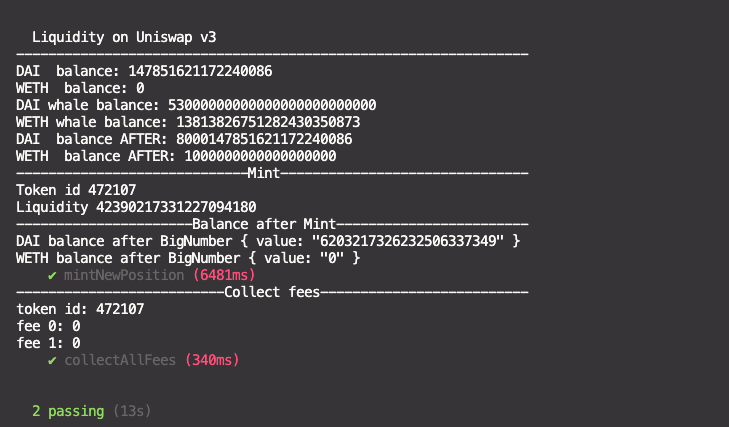
</div>

No fees in this case

<p align="right">(<a href="#readme-top">back to top</a>)</p>

## Uniswap V3 Liquidity of a single position 

We previously derived the curve for the real reserves.

Let's use this equation to derive the equation for the liquidity(this equation has 3 parts):

<div>
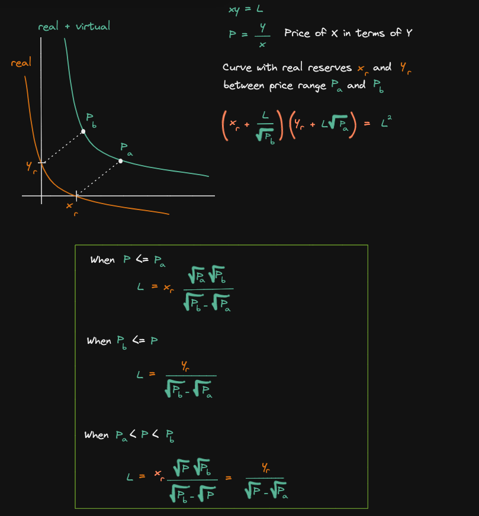
</div>

Let's start with the first case

<div>
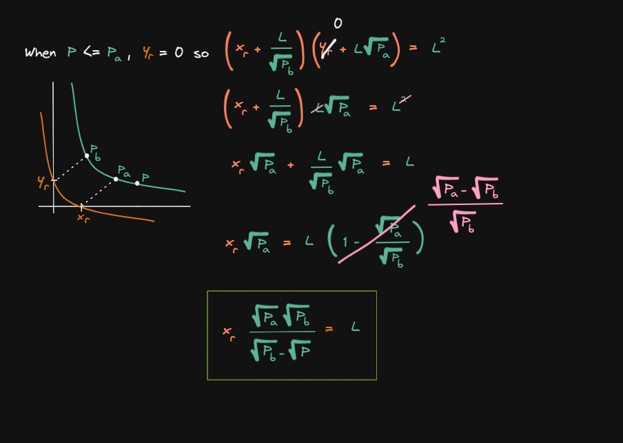
</div>

Let's derive the equation for liquidity when the current price >= Pb

<div>
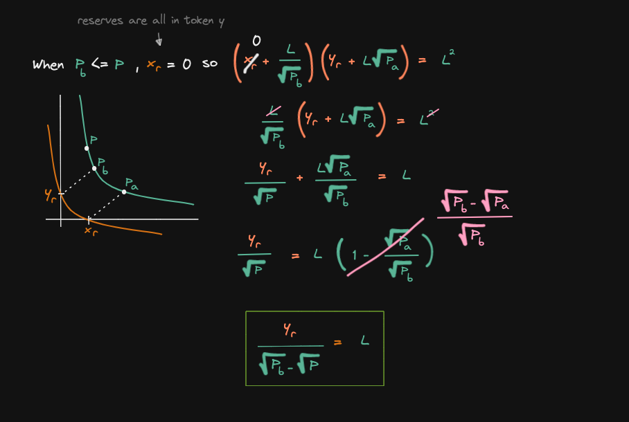
</div>

Let's apply the same technique to find Ly

<div>
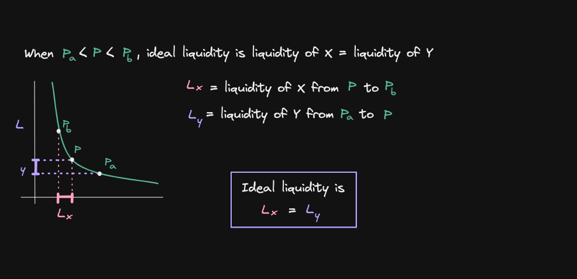
</div>

Find Lx and Ly

<div>
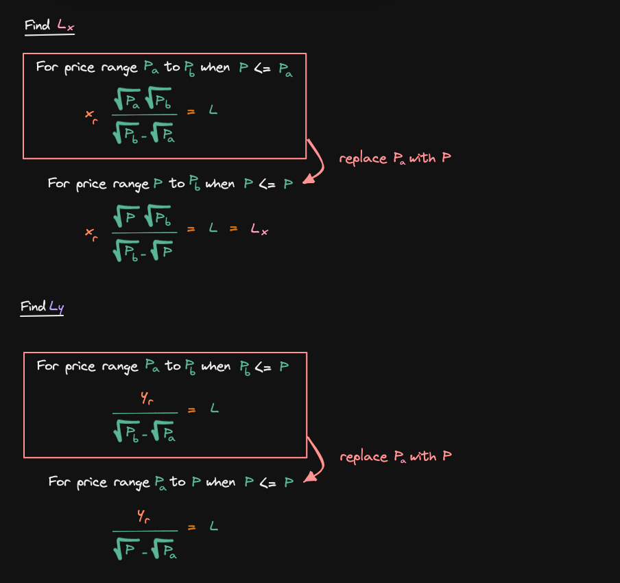
</div>

Finally let's put the two equations that we derived earlier

<div>
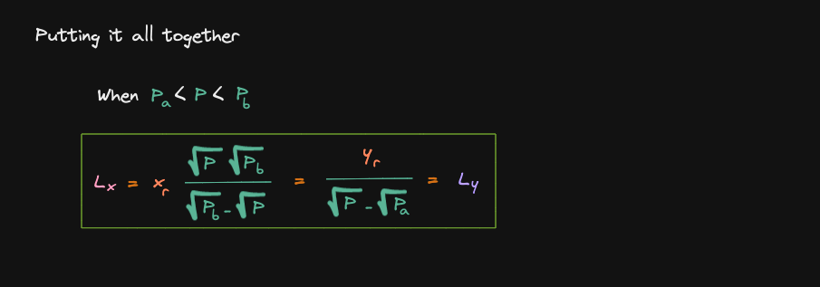
</div>

<p align="right">(<a href="#readme-top">back to top</a>)</p>

## Test Increase liquidity

```sh
npx hardhat test test/liquidityV3.test.js
```

<div>
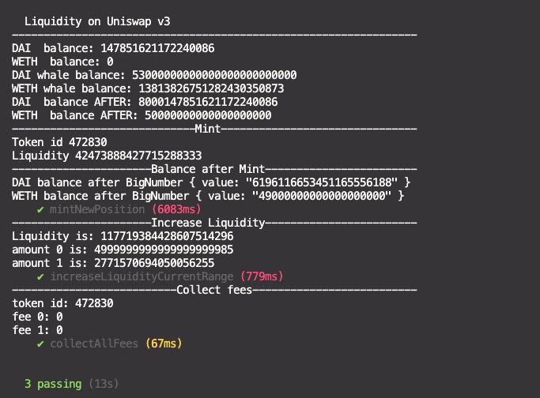
</div>

<p align="right">(<a href="#readme-top">back to top</a>)</p>

5000 DAI and 2,77 WETH added

Amounts specified in `liquidityV3.test.js`:

```js
const daiAmount = 5000n * 10n ** 18n;
const wethAmount = 10n * 10n ** 18n;
```

Learn more about [Add liquidity - How many dx, dy to add?](https://github.com/Aboudoc/Constant-Product-AMM#Constant-Product-AMM) in this repo about Constant Product AMM

## Test Decrease liquidity

```sh
npx hardhat test test/liquidityV3.test.js
```

When we call the function `decreaseLiquidity`, it doesn't transfer the tokens back to contract

To actually withdraw the tokens from Uniswap V3, after calling the function `decreaseLiquidity()`, we'll have to call the function `collect()`

<div>
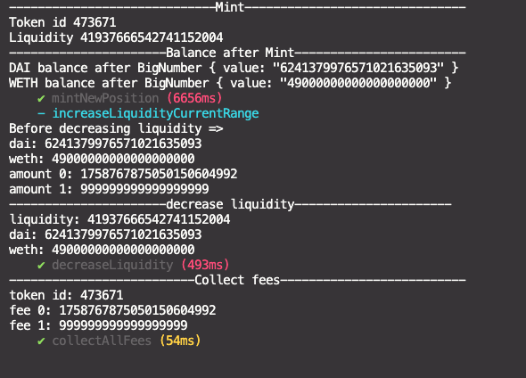
</div>

Note that after calling `decreaseLiquidity`, DAI balance and WETH balance remain the same

<p align="right">(<a href="#readme-top">back to top</a>)</p>

## Uniswap V3 Liquidity Delta

<div>
 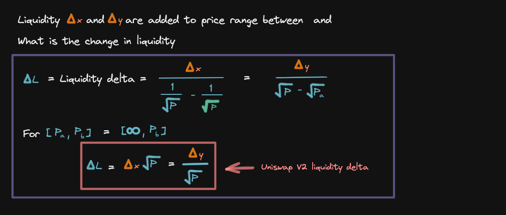
</div>

let's derive these two equations

First, preliminary math:

<div>
 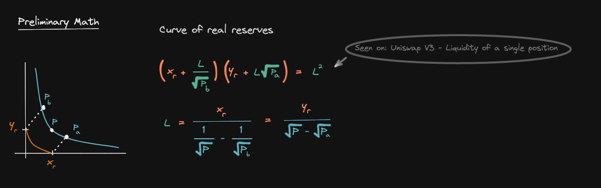
</div>

Let's define liquidity delta

<div>
 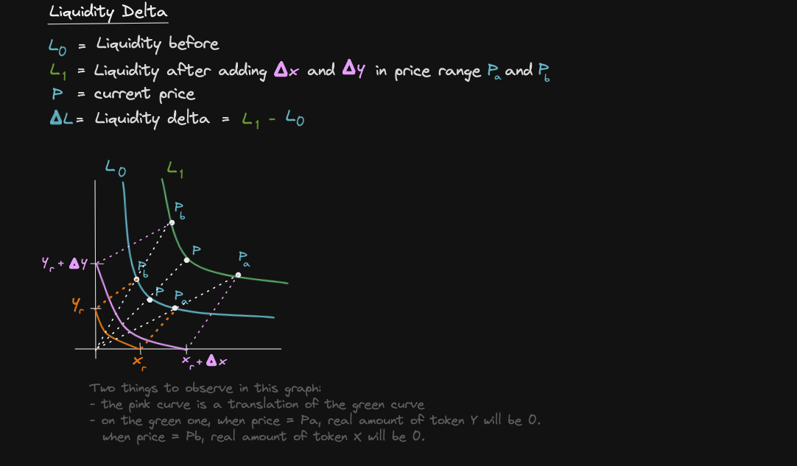
</div>

Four steps to calculate liquidity delta:

<div>
 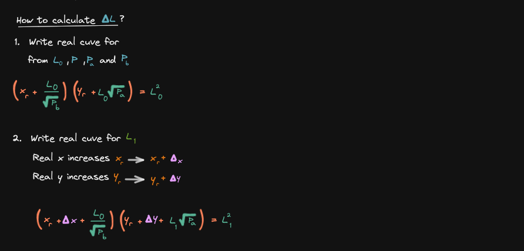
</div>

<div>
 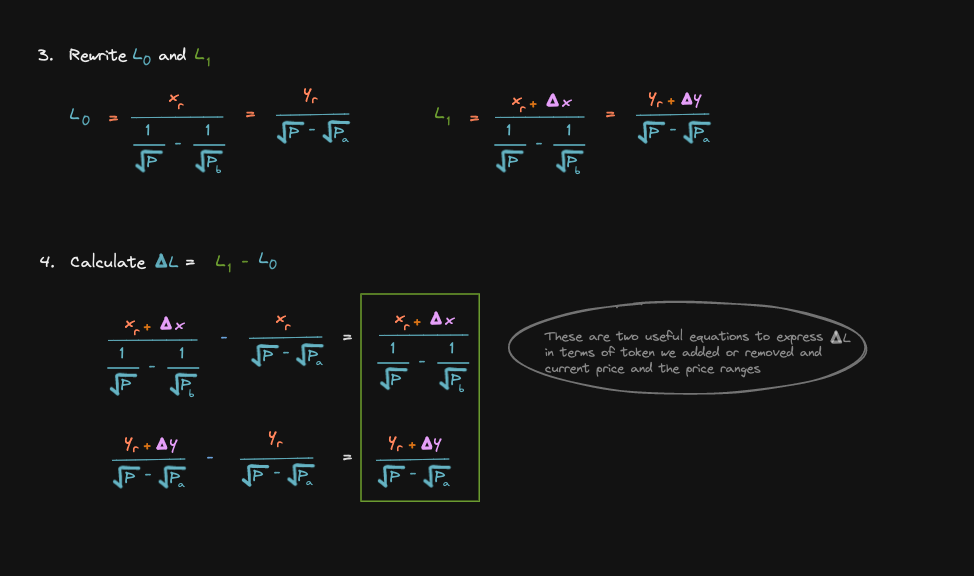
</div>

<p align="right">(<a href="#readme-top">back to top</a>)</p>

## Uniswap V3 How many tokens to add

Let's see a real example of how to calculate the amount of tokens needed when we add liquidity to Uniswap V3

How much USDC will we need to add with the following parameters?

<div>
 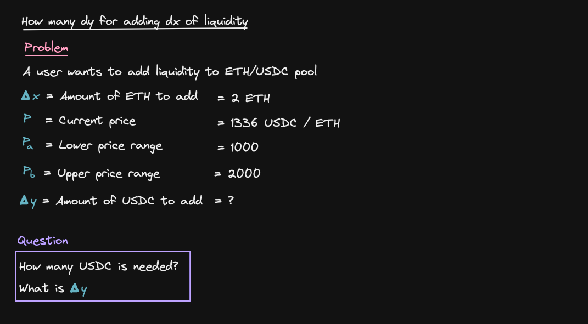
</div>

How do we compute delta Y? We'll use the previous equation (Uniswap V3 Liquidity Delta)

<div>
 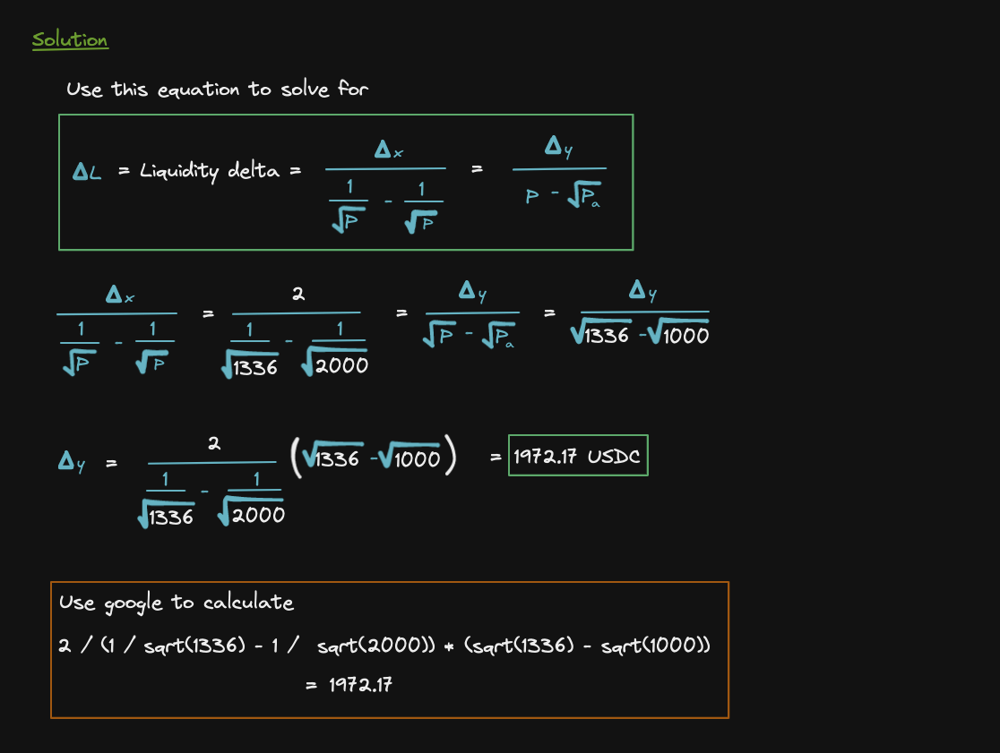
</div>

### Comparing with user interface

You can access the [uniswap app](https://app.uniswap.org/#/swap) to compare the amount of USDC that we will need to put in when the price of ETH is $1754

<div>
 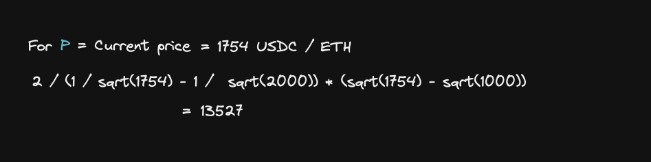
</div>

If we compare with the UI, the result is very close

<div>
 
</div>

<p align="right">(<a href="#readme-top">back to top</a>)</p>

## Uniswap V3 Add and Remove Liquidity

Manage liquidity in Uniswap V3

Mint new position
Increase liquidity
Decrease liquidity
Collect fees and withdraw tokens

### State variables

Contract inherits from `IERC721Receiver`

1. Address of tokens. Set MIN_TICK, MAX_TICK, TICK_SPACING
2. Set interfaces for tokens and manager with the `INonfungiblePositionManager` interface

### Function onERC721Received

This function is called when safeTransferFrom is called on INonFungiblePositionManager.

### Function onERC721Received

1. Transfer `wethAmountDesired` and `daiAmountDesired` from `msg.sender`
2. Approve `amountwethAmountDesired` and `daiAmountDesired` to `router`
3. Call `addLiqiuidity()` on `router` and store `wethAmount`, `daiAmount` and `liquidity` returned from the function call
4. Refund to msg.sender, excess WETH and DAI that were not added to liquidity

### Function mint

This function removes liquidity from the Uniswap WETH - DAI pool.

1. Transfer DAI and WETH from `msg.sender` into this contract. `amount0ToAdd` is DAI amount,`amount1ToAdd` is WETH
2. Approve `manager` to spend DAI and WETH from this contract
3. Set `tickLower` and `tickUpper`, price range to add liquidity. Both ticks must be a multiple of `TICK_SPACING`.
4. Prepare parameter to add new liquidity and mint new position
5. Add liquidity by calling `manager.mint` with the parameters prepared above
6. manager.mint returns 4 outputs. Refund tokens not added to liquidity back to msg.sender. We pulled in amount0ToAdd and amount1ToAdd. Actual amount added to Uniswap V3 are amount0 and amount1.
7. Reset approvals of DAI and WETH for manager to 0
8. Emit Mint with tokenId.

<p align="right">(<a href="#readme-top">back to top</a>)</p>

## Uniswap V3 Price of ETH from sqrtPriceX96

<div>
 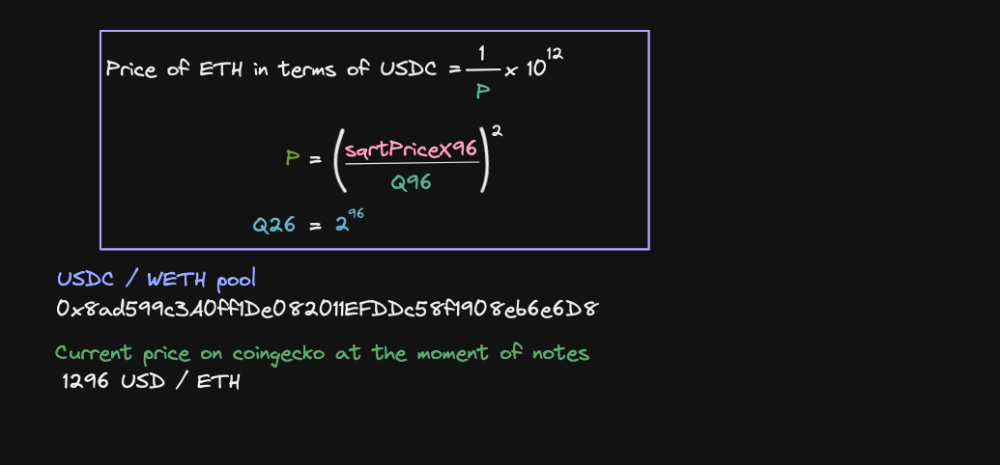
</div>

Let's find out where the 10\*\*12 comes from

First, let's find P through an example

<div>
 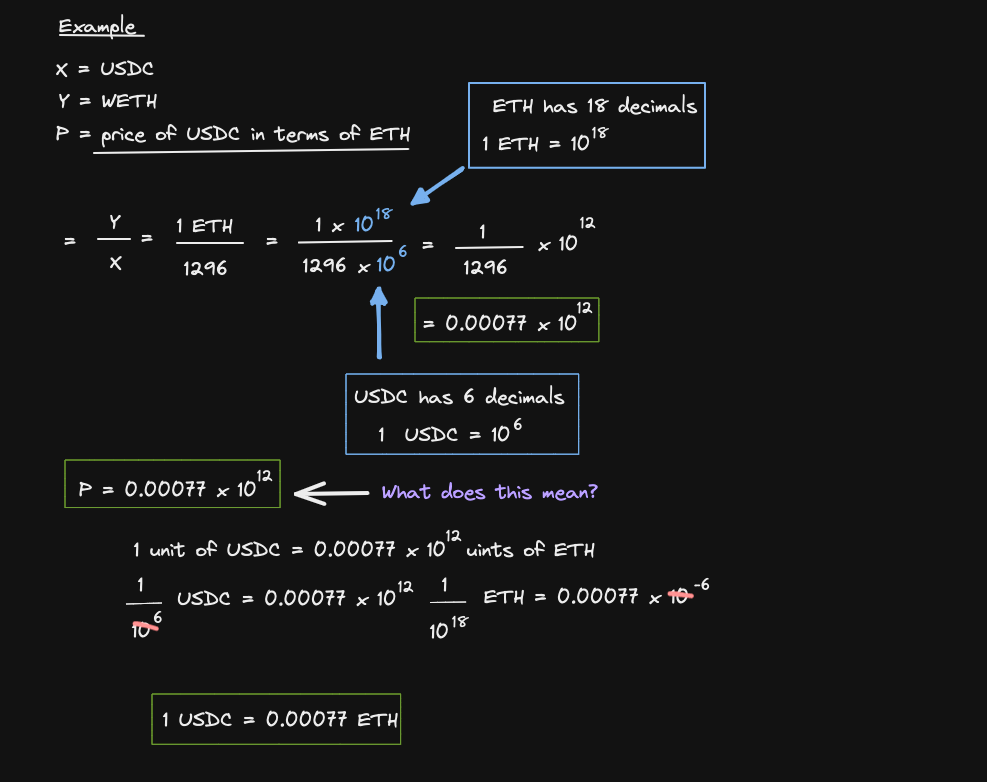
</div>

But we are interested in the price of ETH in terms of USDC

<div>
 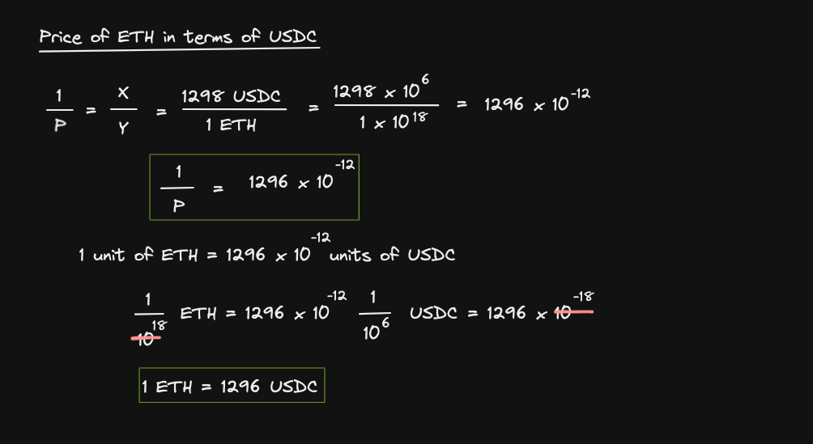
</div>

But how we calculate the price of ETH starting from sqrtPriceX96?

This is the variable related to the price of tokens, stored in Uniswap V3 contract

<div>
 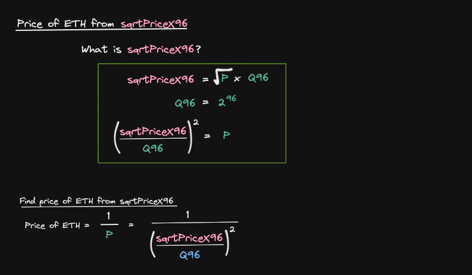
</div>

Find `sqrtPriceX96` variable on [Uniswap USDC / ETH pool contract](https://etherscan.io/address/0x8ad599c3A0ff1De082011EFDDc58f1908eb6e6D8#readContract)

<div>
 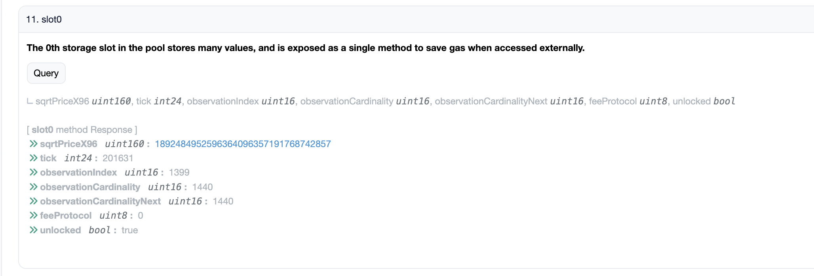
</div>

Let's consider `sqrtPriceX96 = 2200755647817846498385002322429664`. The same can be done with the actual sqrtPriceX95

<div>
 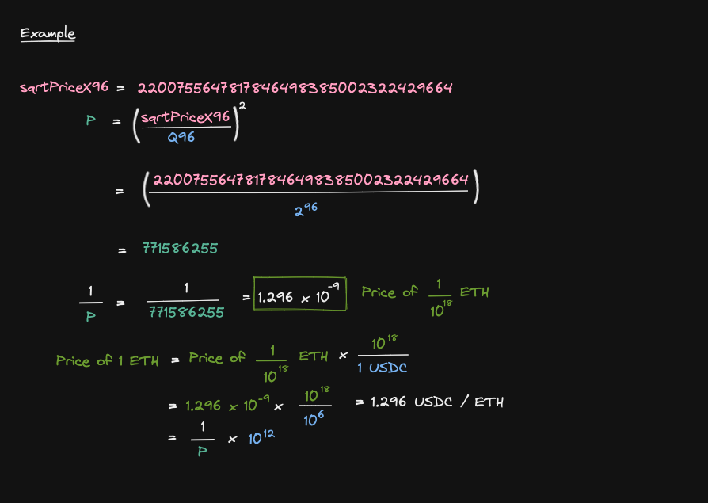
</div>

<p align="right">(<a href="#readme-top">back to top</a>)</p>

## Uniswap V3 Tick and sqrtPriceX96

let's see how to convert from `tick` to `sqrtPriceX96` and from `sqrtPriceX96` to `tick`

First, let's start by reviewing some of the variables

<div>
 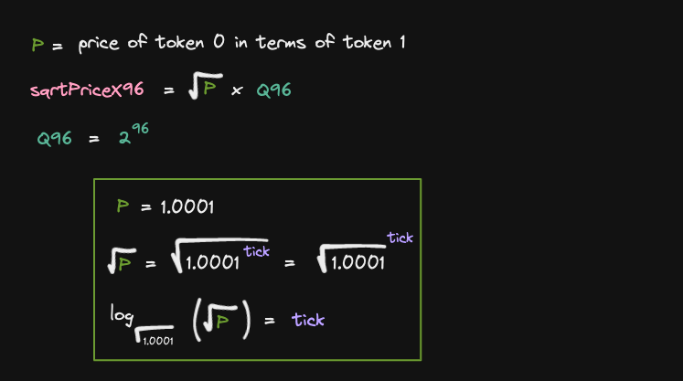
</div>

We're gonna need these two equations to calculate from `tick` to `sqrtPriceX96` and from `sqrtPriceX96` back to `tick`

<div>
 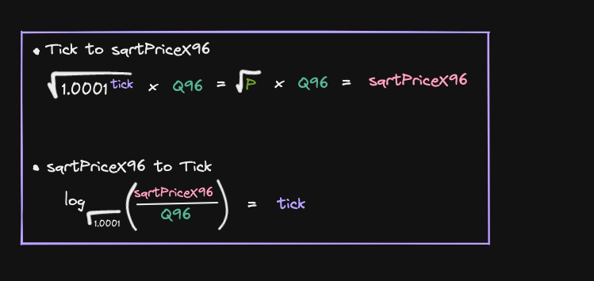
</div>

For the first example, we'll say tht we know what the `tick` is and we'll try to compute the `sqrtPriceX96`

<div>
 
</div>

Let's use `python` to compute `sqrtPriceX96` and `tick`

Use [python jupyter notebook](https://jupyter.org/try-jupyter/retro/notebooks/)

```py
import math

Q96 = 2 ** 96

def tick_to_sqrt_price_x_96(tick):
    return int(1.0001 ** (tick / 2) * Q96)

def sqrt_price_x_96_to_tick(sqrt_price_x_96):
    base = math.sqrt(1.0001)
    p = sqrt_price_x_96 / Q96
    return math.floor(math.log(p, base))

tick = 204632

tick_to_sqrt_price_x_96(tick)

sqrt_price_x_96 = 1892484952596364096357191768742857
sqrt_price_x_96_to_tick(sqrt_price_x_96)
```

<div>
 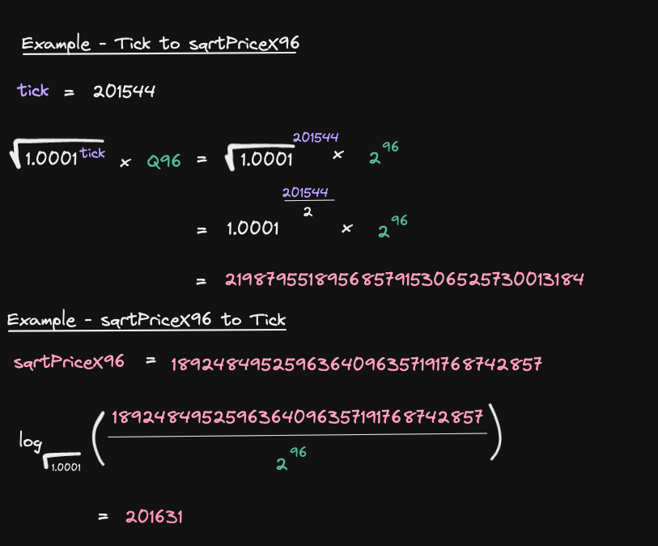
</div>

<p align="right">(<a href="#readme-top">back to top</a>)</p>

## Uniswap V3 Price Change from a Swap

<div>
 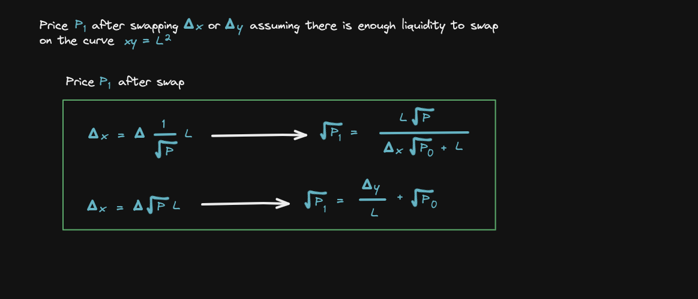
</div>

First, let's explain what we mean by "we are assuming there is enough liquidity to swap on the curve"

<div>
 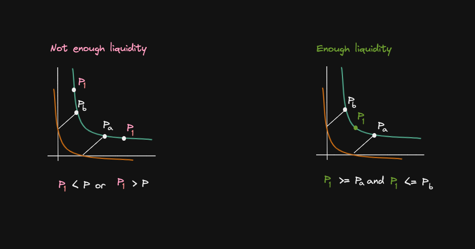
</div>

- Liquidity is only supported between the price range `Pa` and `Pb`, and the price after the swap falls outside of the price range range
- In the second case, the price P1 after the swap remains in the range `Pa` and `Pb`

Let's go over the math, let's derive the equations

<div>
 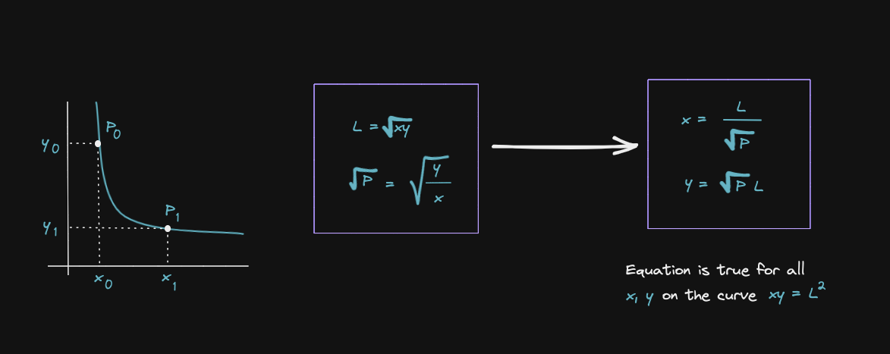
</div>

=> These equations can be applied to Y0, Y1, X0 and X1 since all of these points are on the curve XY = L2

This is a important fact to remember as we will derive the equations for delta x and delta y

<div>
 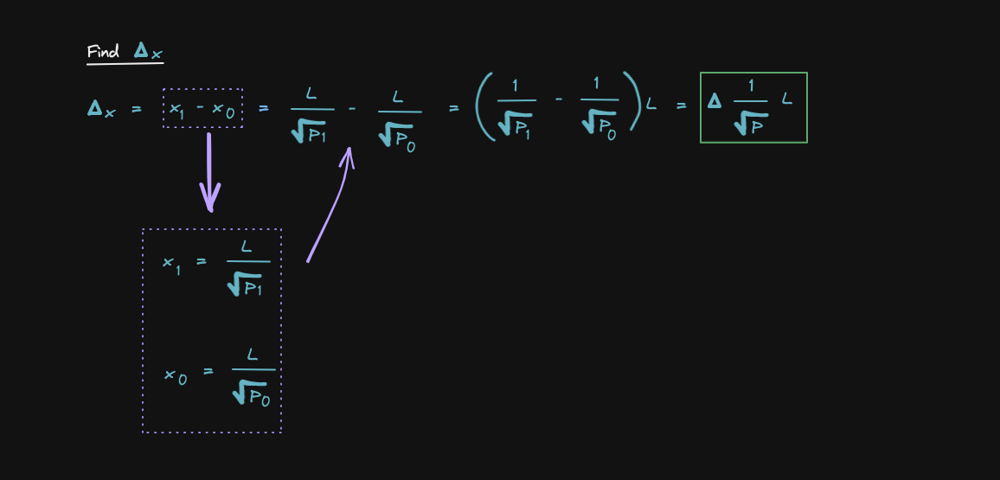
</div>

We'll do the same trick to find delta y

<div>
 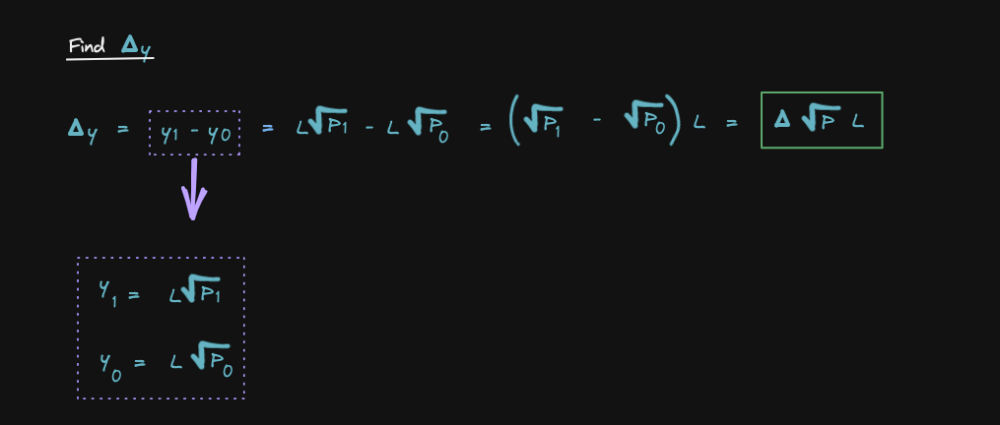
</div>

Finally, let's derive the equations for sqrt(P1) and sqrt(P2)

<div>
 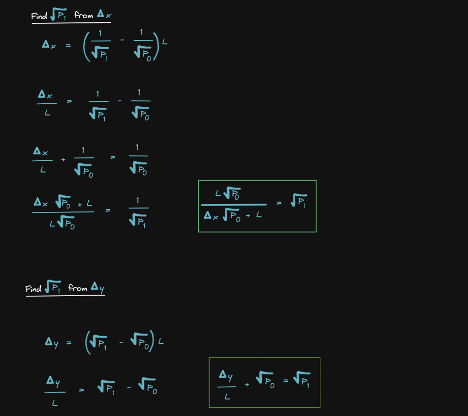
</div>

<p align="right">(<a href="#readme-top">back to top</a>)</p>

## Uniswap V3 Liquidity Price Graph

Let's see how to read liquidity price graph

The current liquidity on Uniswap v3 is `L` and we are trading on the curve `XY = L2`

There is a single position supporting this liquidity from the price range `[Pa - Pb]`

From `Pa`, `Pb` and the current price `P`, let's convert to `ticks` (equations inside the square) and let's map it horizontally.

The vertical axis represents liquidity

=> To the left of the current tick `t`, all the tokens will be in token 1 (`Y`)

=> To the right of the current tick `t`, all the tokens will be in token 0 (`X`)

<div>
 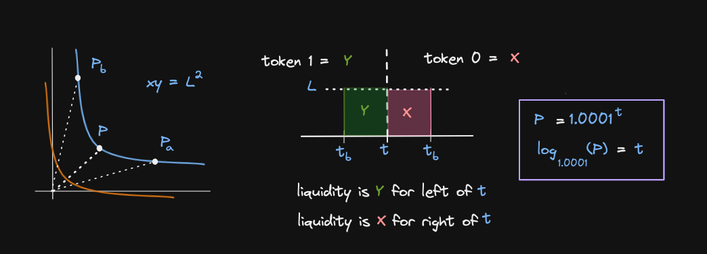
</div>

Let's see why this is:

<div>
 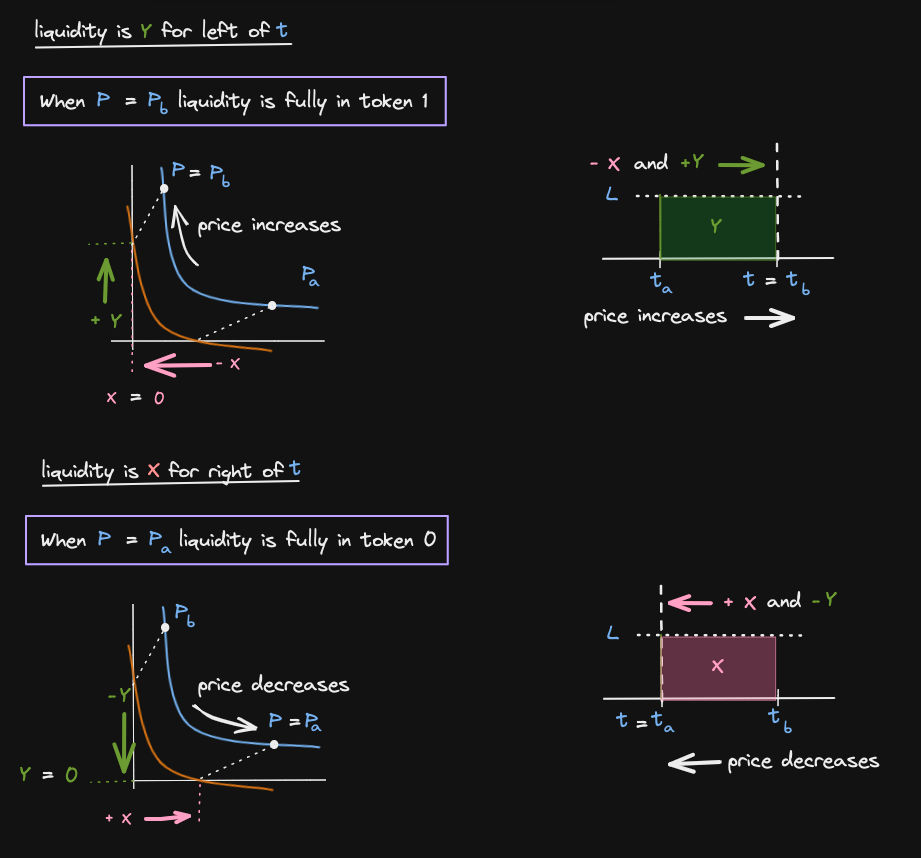
</div>

**When the current price is equal to Pb, then the liquidity is fully in token Y**

**When the price P is equal to Pa, then the liquidity is fully in token X**

**=> Combinng these two observations, we know that liquidity is in Y for the left of the current tick t, and liquidity is X for the right of t**

<p align="right">(<a href="#readme-top">back to top</a>)</p>

## Uniswap V3 Liquidity Price Graph Example

In the following Liquidity Price Graph of the ETH / USDC pool, in pink you can see the current price

To the left of the current price all of the tokens are in USDC

And to the right of the current price, all of the liquidity are in ETH

<div>
 
</div>

Let's see why

Notice that in the graph below:

- X is on the left and Y is on the right
- ticks are negative

<div>
 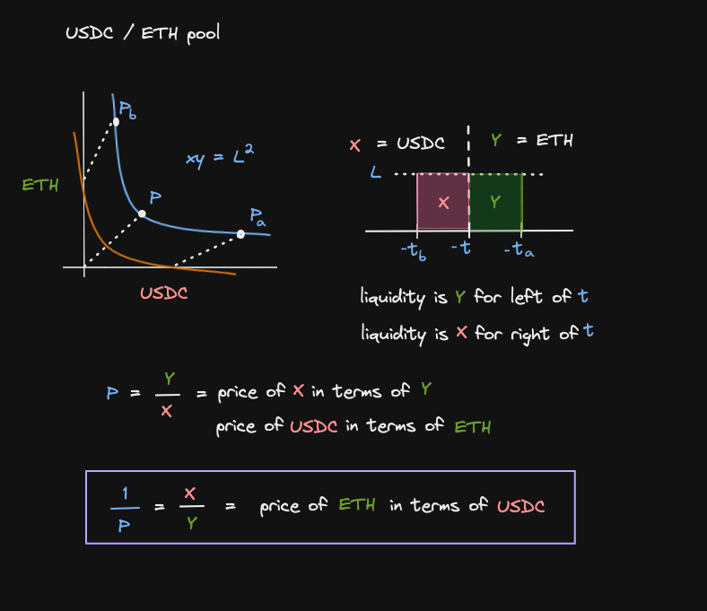
</div>

Instead of P increasing to the right, we want to convert this into a graph where 1 / P increases to the right

Inside the first purple rectangle below, we start by mapping the ticks to this new graph (we flip the inequality before mapping into the graph), then we convert 1 / P to ticks inside the second purple rectangle

<div>
 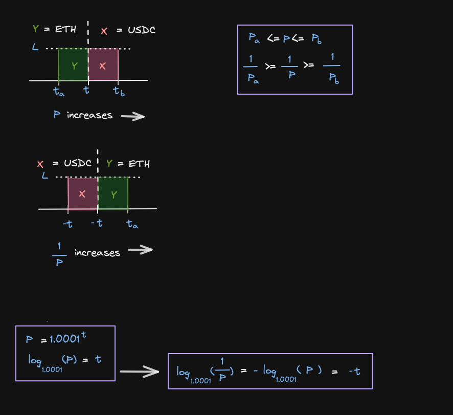
</div>

Here is the link to the [ETH / USDC pool](https://info.uniswap.org/#/pools/0x88e6a0c2ddd26feeb64f039a2c41296fcb3f5640) on Uniswap v3

<p align="right">(<a href="#readme-top">back to top</a>)</p>

## Test Flash Swap

```sh
npx hardhat test test/unlock-account.test.js
```

```sh
npx hardhat test test/flashSwapV3.test.js
```

<!-- <div>

</div> -->

```sh
npx hardhat test test/flashSwapArbV3.test.js
```

<!-- <div>

</div> -->

## Uniswap V3 Flash Swap

Tokens in the pool can be borrowed as long as they are repaid in the same transaction plus fee on borrow.

This is called **flash swap**.

Borrow tokens from Uniswap V3 pool and then repay with fee in a single transaction. This is called flash loan.

We'll call `flash` on Uniswap V3 pool to borrow WETH.

### State Variables

1. Address of tokens and the address of the factory
2. Set WETH interface and declare pool (IUniswapV3Pool)
3. Set `POOL_FEE`to 3000 because we'll call DAI / WETH pool with 0.3% fee
4. Declare struct `FlashData` with `wethAmount`and `caller`

### Constructor

1. The variable pool is immutable, so initialize it inside the constructor.
2. Address of the pool can be obtained by calling `PoolAddress.computeAddress`.
3. PoolKey can be obtained by calling `PoolAddress.getPoolKey`

### Function flash

1. Prepare data of bytes to send. This can be any data, as long as it is not empty Uniswap will trigger a flash swap. For this example, we encode WETH and msg.sender.
2. Call `swap()`on pair. Find below `swap()` from `IUniswapV2Pair`

```js
function swap(
   uint amount0Out,
   uint amount1Out,
   address to,
   bytes calldata data
) external;

```

`amount0Out`: Amount of token0 to withdraw from the pool => 0

`amount1Out`:Amount of token1 to withdraw from the pool => wethAmount

`to`: Recipient of tokens in the pool => address(this)

`data`: Data to send to uniswapV2Call => data

### Function uniswapV3FlashCallback

This function is called by the DAI/WETH pair contract after we called pair.swap.

Immediately before the pool calls this function, the amount of tokens that we requested to borrow is sent. Inside this function, we write our custom code and then repay the borrowed amount plus some fees.

1. Require that `msg.sender` is pair. Only pair contract should be able to call this function.
2. Require `sender` is this contract. Initiator of the flash swap should be this contract.
3. Decode `data`. Inside flashSwap we've encoded WETH and msg.sender.
4. Once the data is decoded, we would write our custom code here (arbitrage). We only emitted events for this example
5. Calculate total amount to repay
6. Transfer fee amount of WETH from caller (about 0.3% fee, +1 to round up)
7. Repay WETH to pair, amount borrowed plus fee

<p align="right">(<a href="#readme-top">back to top</a>)</p>

## Forking mainnet

`hardhat.config.js`

```sh
  networks: {
        hardhat: {
          forking: {
            url: `https://eth-mainnet.alchemyapi.io/v2/${process.env.ALCHEMY_API_KEY}`,
       },
     },
  }
```

Note: Replace the `${}` component of the URL with your personal [Alchemy](https://www.alchemy.com/) API key.

```sh
npx hardhat test test/swapV3.test.js
```

<p align="right">(<a href="#readme-top">back to top</a>)</p>

## Note

This contract assumes that token0 and token1 both have same decimals

Consider Uniswap trading fee = 0.3%

### Further reading

You can find Uniswap pools referenced below. Select a pool with the highest TVL

[Uniswap V3 Pool Infos](https://info.uniswap.org/#/pools)

You can find official Uniswap documentation below:

[Single Hop Swap](https://docs.uniswap.org/contracts/v3/guides/swaps/single-swaps)

[Multi Hop Swap](https://docs.uniswap.org/contracts/v3/guides/swaps/multihop-swaps)

### Sources

<p align="right">(<a href="#readme-top">back to top</a>)</p>

<!-- ROADMAP -->

## Roadmap

- [-] Uniswap V3 TWAP
- [-] Further reading
- [ ] Deploy script
- [-] Unit test

See the [open issues](https://github.com/Aboudoc/Uniswap-v3.git/issues) for a full list of proposed features (and known issues).

<p align="right">(<a href="#readme-top">back to top</a>)</p>

<!-- CONTRIBUTING -->

## Contributing

Contributions are what make the open source community such an amazing place to learn, inspire, and create. Any contributions you make are **greatly appreciated**.

If you have a suggestion that would make this better, please fork the repo and create a pull request. You can also simply open an issue with the tag "enhancement".
Don't forget to give the project a star! Thanks again!

1. Fork the Project
2. Create your Feature Branch (`git checkout -b feature/AmazingFeature`)
3. Commit your Changes (`git commit -m 'Add some AmazingFeature'`)
4. Push to the Branch (`git push origin feature/AmazingFeature`)
5. Open a Pull Request

<p align="right">(<a href="#readme-top">back to top</a>)</p>

<!-- LICENSE -->

## License

Distributed under the MIT License. See `LICENSE.txt` for more information.

<p align="right">(<a href="#readme-top">back to top</a>)</p>

<!-- CONTACT -->

## Contact

Reda Aboutika - [@twitter](https://twitter.com/AboutikaR) - reda.aboutika@gmail.com

Project Link: [https://github.com/Aboudoc/Uniswap-v3.git](https://github.com/Aboudoc/Uniswap-v3.git)

<p align="right">(<a href="#readme-top">back to top</a>)</p>

<!-- ACKNOWLEDGMENTS -->

## Acknowledgments

- [Smart Contract Engineer](https://www.smartcontract.engineer/)

<p align="right">(<a href="#readme-top">back to top</a>)</p>

<!-- MARKDOWN LINKS & IMAGES -->
<!-- https://www.markdownguide.org/basic-syntax/#reference-style-links -->

[contributors-shield]: https://img.shields.io/github/contributors/Aboudoc/Uniswap-v3.svg?style=for-the-badge
[contributors-url]: https://github.com/Aboudoc/Uniswap-v3/graphs/contributors
[forks-shield]: https://img.shields.io/github/forks/Aboudoc/Uniswap-v3.svg?style=for-the-badge
[forks-url]: https://github.com/Aboudoc/Uniswap-v3/network/members
[stars-shield]: https://img.shields.io/github/stars/Aboudoc/Uniswap-v3.svg?style=for-the-badge
[stars-url]: https://github.com/Aboudoc/Uniswap-v3/stargazers
[issues-shield]: https://img.shields.io/github/issues/Aboudoc/Uniswap-v3.svg?style=for-the-badge
[issues-url]: https://github.com/Aboudoc/Uniswap-v3/issues
[license-shield]: https://img.shields.io/github/license/Aboudoc/Uniswap-v3.svg?style=for-the-badge
[license-url]: https://github.com/Aboudoc/Uniswap-v3/blob/master/LICENSE.txt
[linkedin-shield]: https://img.shields.io/badge/-LinkedIn-black.svg?style=for-the-badge&logo=linkedin&colorB=555
[linkedin-url]: https://www.linkedin.com/in/r%C3%A9da-aboutika-34305453/?originalSubdomain=fr
[product-screenshot]: https://ethereum.org/static/28214bb68eb5445dcb063a72535bc90c/9019e/hero.webp
[Hardhat]: https://img.shields.io/badge/Hardhat-20232A?style=for-the-badge&logo=hardhat&logoColor=61DAFB
[Hardhat-url]: https://hardhat.org/
[Ethers.js]: https://img.shields.io/badge/ethers.js-000000?style=for-the-badge&logo=ethersdotjs&logoColor=white
[Ethers-url]: https://docs.ethers.org/v5/
[Vue.js]: https://img.shields.io/badge/Vue.js-35495E?style=for-the-badge&logo=vuedotjs&logoColor=4FC08D
[Vue-url]: https://vuejs.org/
[Angular.io]: https://img.shields.io/badge/Angular-DD0031?style=for-the-badge&logo=angular&logoColor=white
[Angular-url]: https://angular.io/
[Svelte.dev]: https://img.shields.io/badge/Svelte-4A4A55?style=for-the-badge&logo=svelte&logoColor=FF3E00
[Svelte-url]: https://svelte.dev/
[Laravel.com]: https://img.shields.io/badge/Laravel-FF2D20?style=for-the-badge&logo=laravel&logoColor=white
[Laravel-url]: https://laravel.com
[Bootstrap.com]: https://img.shields.io/badge/Bootstrap-563D7C?style=for-the-badge&logo=bootstrap&logoColor=white
[Bootstrap-url]: https://getbootstrap.com
[JQuery.com]: https://img.shields.io/badge/jQuery-0769AD?style=for-the-badge&logo=jquery&logoColor=white
[JQuery-url]: https://jquery.com
